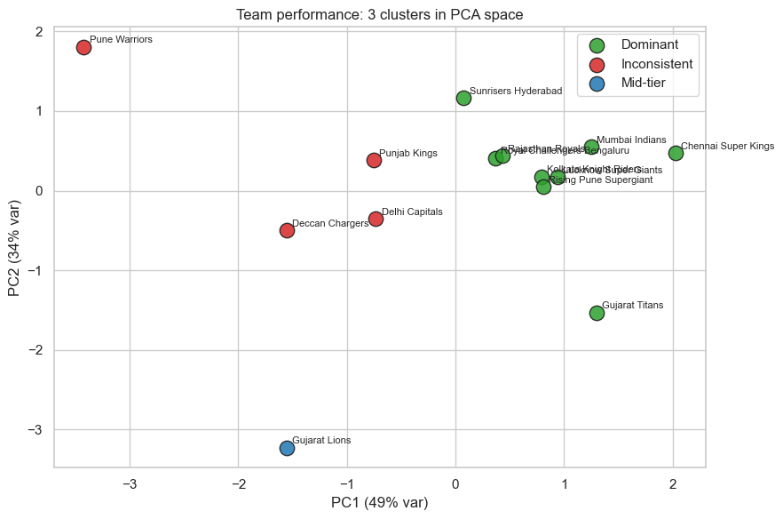
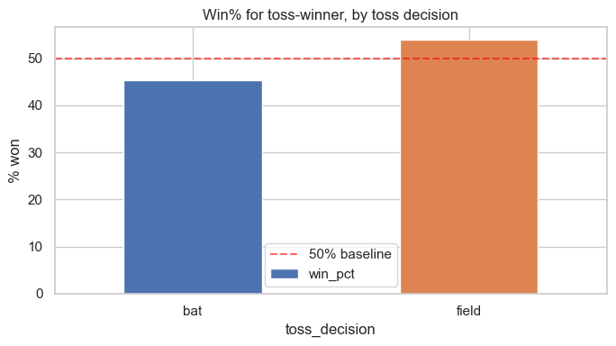
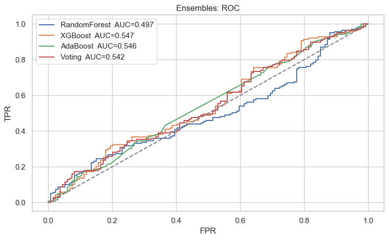
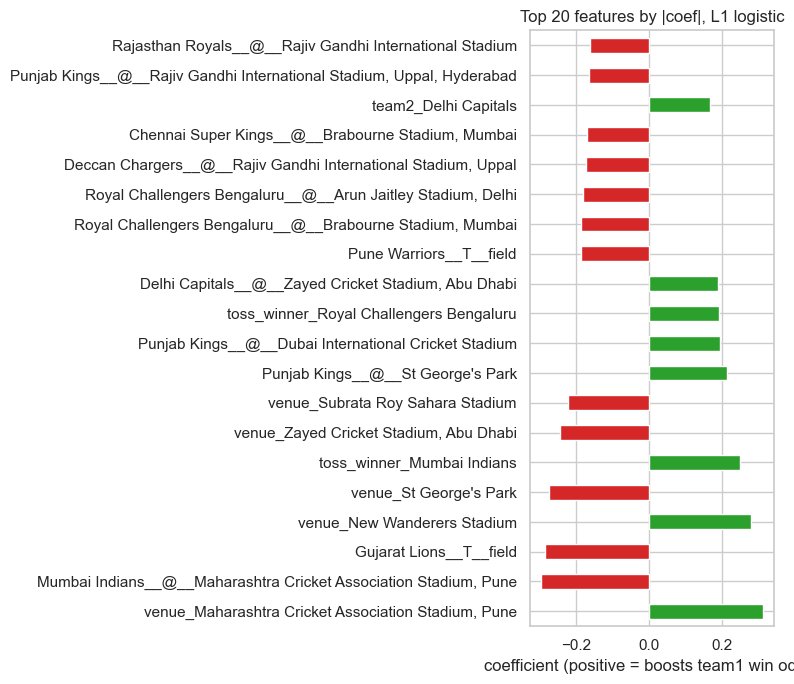
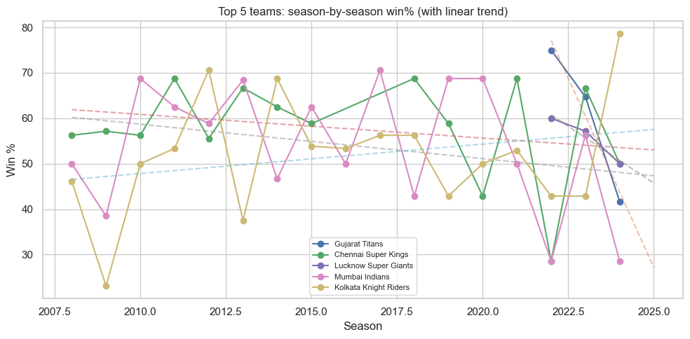

# IPL 2008-2024: A Franchise Analytics Case Study

> **End-to-end analysis of 1,095 IPL matches across 17 seasons: leakage-free feature engineering, PCA-based team clustering, match-outcome models, and 6 costed recommendations for a franchise's Head of Cricket Operations.**


**[Read the notebook rendered in nbviewer](https://nbviewer.org/github/Umarfarook1/ipl-data-analysis/blob/main/notebook.ipynb)** — no clone needed.

This is a single, narrative notebook written the way a senior data scientist would hand work to a cricket franchise: eleven business questions, each finishing with what it actually means for the team, and a closing executive summary the Head of Cricket Operations can take into pre-season planning. The headline is not a flashy accuracy number. It is the discipline: chronologically computed features with no leakage, three independent methods converging on the same toss heuristic, and an honest account of exactly where match-level data stops being useful.

## Hero result: teams cluster cleanly by venue familiarity, not just raw win rate

Four engineered team metrics (career win %, average winning margin, toss-to-win conversion, and a "venue familiarity edge") were standardized, clustered with K-Means (k = 3 from the elbow), and projected into 2D with PCA. The clusters separate into Dominant, Mid-tier, and Inconsistent franchises, and the most discriminative axis turned out to be the venue familiarity edge, not overall strength.



*Dominant teams (Chennai Super Kings at 58.23% career win, Mumbai Indians at 55.17%) tend to carry a positive familiarity edge, meaning they win more at their three most-played grounds than elsewhere. Inconsistent teams sit near zero or negative. The practical read: a shared or relocated home venue should be expected to cost win percentage unless the side actively retrains at the new ground.*

## Problem and why it matters

A franchise's analytics team gets asked the same questions every off-season: which venues actually favour us, which players are undervalued at auction, is a rival on the way up or fading, and can we put a number on next match's win probability for the war room. Most public IPL notebooks answer these with leaky features (computing "form" using the whole season including the future) and then quote an impressive-looking accuracy that would not survive contact with a real fixture.

I wanted the opposite: features that respect the arrow of time, metrics chosen because they answer a specific operational question, and a frank statement of the modelling ceiling so nobody ships a coin-flip dressed up as a predictor.

## Dataset

- **Source:** match-level IPL results, 2008 to 2024, in `data/IPL_2008_2024.csv`.
- **Size:** 1,095 matches across 17 seasons, 20 columns, covering League, Qualifier, Eliminator, Semi Final and Final fixtures (1,029 League games, 17 Finals).
- **Cleaning:** missingness was concentrated and explainable. The `method` column is null by design (1,074 rows) because it only populates for Duckworth-Lewis adjusted matches; 51 missing cities were mostly UAE venues from 2009 and 2020, back-filled from venue name where possible; 5 abandoned matches were flagged as `No Result` rather than dropped silently. After cleaning, `assert df.isna().sum().sum() == 0` holds.
- **Franchise canonicalization:** renamed teams are rolled together (Delhi Daredevils to Delhi Capitals, RCB Bangalore to Bengaluru, Kings XI Punjab to Punjab Kings, Rising Pune Supergiants to Supergiant) so the time series and clustering do not fracture across name changes.

## Approach

The whole study reuses five features engineered once in Q1, which keeps later sections cheap and consistent:

- `home_advantage`, `venue_matches_team1_prior` / `venue_matches_team2_prior` (computed by walking the fixtures in date order so a match never sees its own future), `match_importance` (League / Playoff / Final), `toss_advantage`, and `season_phase`.

Methods, and why each was chosen rather than defaulted to:

- **EDA on toss and venues** to establish the base rates everything else is measured against.
- **Bag-of-words and TF-IDF on Player-of-the-Match names** so that season-distinctive and venue-specialist players surface above the raw-frequency leaders, which is exactly what a scouting board needs at auction.
- **K-Means + PCA** for unsupervised team tiers (the hero figure above).
- **Apriori association rules** (`min_support = 0.1`, `min_confidence = 0.7`) over toss decision, venue chase-bias bucket, shortened-match flag and result.
- **L1 and L2 logistic regression** with one-hot categoricals plus two interaction blocks (team x venue, team x toss decision), SMOTE for the mild class imbalance, and L1 preferred for interpretability because it zeroes out weak features.
- **KNN as a top-K recommender** for Player of the Match, because single-label accuracy is meaningless across roughly 291 candidate players.
- **A depth-5 decision tree** for the toss call, deliberately small so it prints as a one-page card for the captains' room.
- **Bagging vs boosting** (Random Forest, XGBoost, AdaBoost, plus a soft-voting ensemble) to test whether more model complexity buys anything on match-level data.

## Results

### The toss finding, triangulated three ways

The toss winner wins only **50.83%** of completed matches, a real but tiny bias. The interesting structure is in the decision: when the toss winner chose to **bat first they won just 45.38%** of the time, but when they chose to **field first they won 53.86%**. Chasing teams win materially more, consistent with the known dew effect in night games.



This same heuristic, "field first at chase-friendly venues," then re-emerged independently from the Apriori rules (25 rules found, with lift in the modest 1.1 to 1.3 range) and from the logistic regression coefficients and the decision tree. Three methods, three framings, one answer is a far stronger signal than any single model.

### Match-outcome modelling: an honest ceiling

Predicting whether `team1` wins, from a 414-column feature matrix over 1,090 completed matches, the models barely separate from chance. That is the finding, not a failure to report.

| Model | Accuracy | ROC-AUC | Notes |
|-------|---------:|--------:|-------|
| Baseline (majority / coin flip) | ~0.509 | 0.500 | class balance is 50.9% team1 wins |
| Logistic L1 | 0.476 | 0.477 | sparse, used for coefficient reading |
| Logistic L2 | 0.480 | 0.474 | SMOTE-balanced, C = 0.5 |
| Random Forest | 0.465 | 0.497 | 300 trees, depth 10 |
| AdaBoost | 0.531 | 0.546 | best accuracy |
| **XGBoost** | 0.498 | **0.547** | best AUC of the set |
| Soft-Voting ensemble | 0.505 | 0.542 | matches the best single model, lower variance |



**What this means:** every model lands in a tight band around AUC 0.5 to 0.55. This is a data ceiling, not a tuning problem. Match-level metadata has no per-ball detail, no batter-bowler matchups, no over-by-over scoring, so there is simply not enough signal to push past roughly 0.6. The right conclusion for the franchise is to invest in ball-by-ball ingestion, where published IPL studies routinely clear AUC 0.75, rather than to keep tuning a model on metadata.

### Feature interpretation and trend reads

The L1 logistic model's largest positive coefficients are specific team-by-venue and team-by-toss combinations: the matchups where a side has a genuine edge that overall reputation hides. Those are the slots a franchise should prioritise for star-player selection.



For the top-5 teams by career win %, fitting a linear trend per season gives a cheap directional read (improving, flat, or fading) that is easy to communicate at a board meeting, with the explicit caveat that single seasons get wrecked by injuries, retirements, the 2023 Impact Player rule and auction churn.



A note on the bonus sentiment section (Q11): it reports a Pearson r of 0.897 between simulated fan sentiment and win %, but that correlation is mechanical by construction because the simulator is seeded with each team's win rate. It is included as a pipeline demo, clearly labelled as not a real finding, with a note on what a production version (scraped comments plus a transformer sentiment model) would replace.

## How to run

```bash
git clone https://github.com/Umarfarook1/ipl-data-analysis
cd ipl-data-analysis
python -m venv .venv && source .venv/bin/activate   # Windows: .venv\Scripts\activate
pip install -r requirements.txt
jupyter notebook notebook.ipynb
```

The notebook defines `DATA_PATH` near the top. Point it at the bundled CSV before running all cells:

```python
DATA_PATH = "data/IPL_2008_2024.csv"
SEED = 42
```

`SEED = 42` is pinned everywhere, so a full re-run reproduces every number and figure above. The whole notebook runs end-to-end on a laptop in well under a minute.

## Repository structure

```
ipl-data-analysis/
  notebook.ipynb                 # the full eleven-question analysis
  data/
    IPL_2008_2024.csv            # 1,095 matches, 2008-2024
  assets/                        # all exported figures
    plot_21_5.png                # PCA team clusters (hero)
    plot_09_2.png                # toss decision win %
    plot_53_10.png               # ensemble ROC curves
    plot_32_7.png                # L1 logistic top features
    plot_40_8.png                # top-5 team season trends
    ...
  IPL-data-analysis-report.pdf   # written report
  requirements.txt
  README.md
```

## Key takeaways

- **Method discipline over metric chasing.** Chronological, leakage-free features and an honest AUC ceiling read as more credible than an inflated score, and they match how the work would actually be used.
- **Convergent evidence is the real result.** Association rules, logistic coefficients, and a decision tree independently surface the same toss heuristic. That agreement is worth more than any one model.
- **Unsupervised structure tells the operational story.** PCA clustering shows that venue familiarity, not raw strength, is the axis that separates franchise tiers, which directly informs away-fixture preparation.
- **Right metric for the right job.** KNN is framed as a top-K shortlist (single-label accuracy is under 5% across 291 players, exactly as expected) rather than forced into a classifier it can never be.
- **The biggest lever is data, not modelling.** Match metadata caps AUC near 0.6; ball-by-ball ingestion is the step-change, and the closing recommendations cost it out as one engineer for one quarter.

## License

Released under the MIT License. See [LICENSE](LICENSE).
